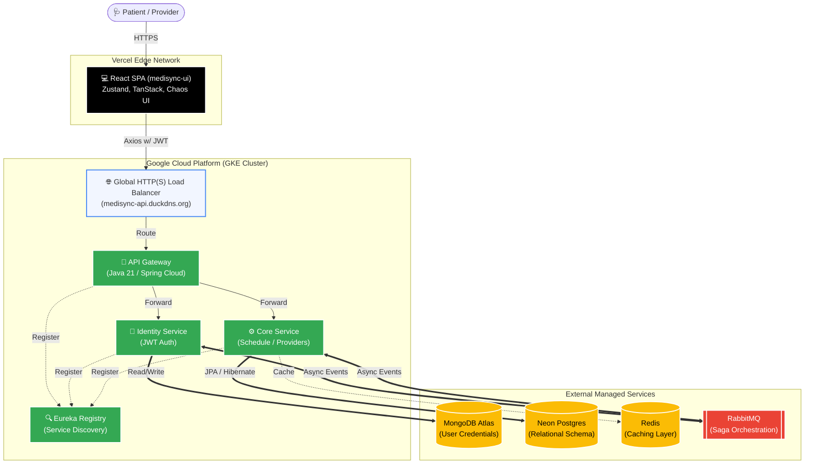

# ⚡ Bhaumik | Software Development Engineer

Building enterprise-grade distributed systems and resilient microservices architectures.

## 💫 About Me
- 🎓 **B.Tech in Computer Science and Engineering** @ Lovely Professional University
- ☁️ Architecting fault-tolerant healthcare and banking ecosystems deployed on **GCP (GKE)** and **AWS**.
- 🧠 Deeply focused on **Java 21**, **Spring Boot**, **Kubernetes**, and distributed data consistency (Saga Pattern).
- 🔗 **Portfolio:** [Check out my live projects](https://portfolio-deploy-six-khaki.vercel.app/)
- 📫 **Reach me:** bhaumik182001@gmail.com

---

## 💻 Enterprise Tech Stack

---

## 🏗️ Featured Architecture

### 🏥 [MediSync: Enterprise Healthcare Microservices](https://github.com/Bhaumik182001/medisync-frontend.git)
A cloud-native microservices ecosystem decoupling complex healthcare domains across 4 independent Java 21 applications. 

* **Core Stack:** Java 21, Spring Boot 4.x, GCP (GKE), Terraform, PostgreSQL, MongoDB, RabbitMQ.
* **Engineering Impact:** Implemented the Saga Orchestration Pattern for distributed data consistency and built a dedicated Chaos Engineering dashboard for resilience testing.

### 🏦 [FinGuard: Enterprise Banking Platform](https://github.com/Bhaumik182001/finguard-sentinel-backend.git)
A highly secure, monolithic banking backend facilitating ACID-compliant financial transactions.
* **Core Stack:** Java 21, Spring Boot 3.x, AWS EC2, PostgreSQL, Nginx, GitHub Actions.
* **Engineering Impact:** Engineered strict pessimistic database locking mechanisms, JWT-based stateless authentication, and automated CI/CD pipelines utilizing ephemeral H2 databases.

---

## 🧠 Algorithms & Problem Solving

### 🧩 [Data Structures & Algorithms Repository](https://github.com/Bhaumik182001/Data-Structure-Algorithms.git)
A centralized, automated repository tracking my continuous algorithmic problem-solving progression across LeetCode and GeeksforGeeks.
* **Focus Areas:** Arrays, Dynamic Programming, Graphs, and Distributed System logic.
* **Consistency:** Secured the LeetCode 50-Days Badge (2025) and continuously expanding this repository as a personal technical wiki.

---

## 🏋️ Beyond the IDE
Engineering isn't just about code; it's about discipline and balance. When I am not architecting backend services, I am usually:
* **Exploring Digital Worlds:** Diving into notoriously unforgiving Dark Souls-style RPGs, open-world titles, and geeking out over hardware performance across PC and console.
* **Building Resilience:** Applying the same strict consistency required in tech to my structured heavy-lifting and bodybuilding routines.

---
## 🌐 Let's Connect
<table>
  <tr>
    <td align="center"></td>
    <td align="center"></td>
  </tr>
</table>

 

